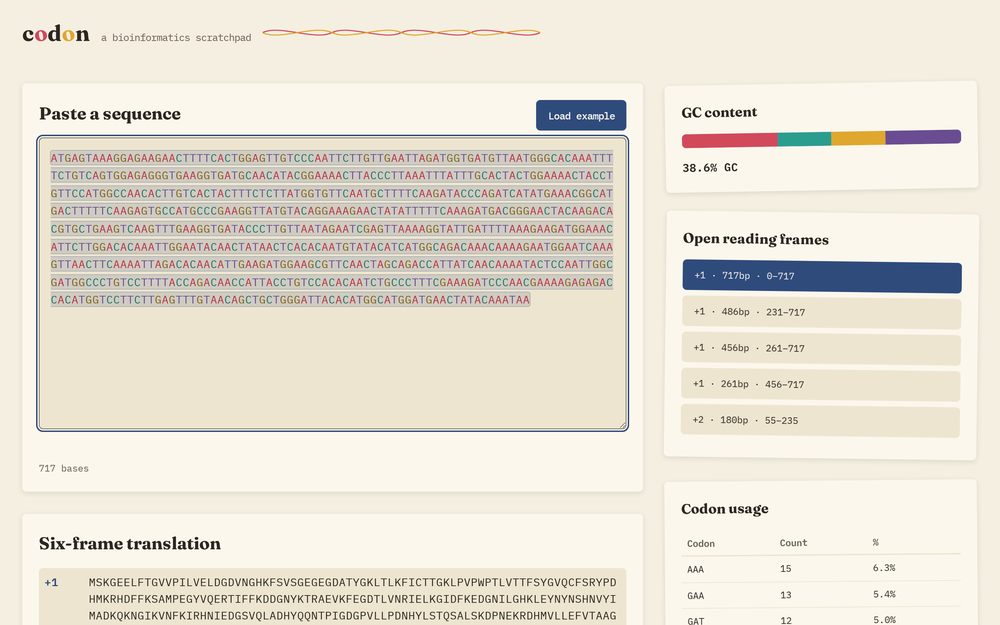

# Codon

**▶ Live demo — [apps.charliekrug.com/codon](https://apps.charliekrug.com/codon/)**

[](https://github.com/ctkrug/codon/actions/workflows/ci.yml)
[](LICENSE)

Read a DNA sequence in your browser. Paste a raw sequence and Codon works out
its GC content, all six reading frames, every open reading frame (ORF), the
translated protein, codon usage, and common restriction sites, live, on your
own machine. No install, no login, no server.



## Who it's for

Biology students and hobbyists who want a quick look at a stretch of DNA
without firing up SnapGene, Geneious, or a Benchling account. You found a gene
on NCBI, you want to see its reading frames and the protein it codes for, and
you want it now, in a browser tab.

## What it does

- **GC content:** a live percentage with a stacked bar split by A, C, G, and
  T, so base composition reads at a glance.
- **Six-frame translation:** all three forward frames and all three
  reverse-complement frames, translated to protein and refreshed on every edit.
- **ORF detection:** every ATG-to-stop run across all six frames, listed
  longest first. The longest is highlighted directly on the sequence; clicking
  any other one in the list highlights and scrolls to it.
- **Codon usage:** every codon present with its count and share, sorted by
  frequency.
- **Restriction sites:** matches for common Type II enzymes (EcoRI, BamHI,
  HindIII, NotI, XhoI, PstI), listed by position and marked inline.
- **Load example:** two real coding sequences (a GFP fragment and the lacZ
  start) to try instantly, no pasting required.

## Usage

Open the [live demo](https://apps.charliekrug.com/codon/), paste a raw `ACGT`
sequence into the box (or press **Load example**), and read the results as they
update. Whitespace and line breaks from FASTA files are stripped automatically;
any character that is not A, C, G, or T is flagged with a clear message.

The genetic code is the NCBI standard translation table 1. Ambiguous or
incomplete codons translate to `X`. Sequences up to 100,000 bases are supported;
longer pastes are turned away rather than freezing the tab.

## Run it locally

```sh
npm install # installs fast-check (property-based tests only; the site ships zero dependencies)
npm test    # run the unit test suite (node:test)
```

Then serve the `site/` directory with any static file server:

```sh
cd site && python3 -m http.server 8080   # or `npx serve`, etc.
```

Opening `site/index.html` directly over a `file://` URL will not work: browsers
block cross-origin `<script type="module">` loads under the `file://` scheme.
The whole `site/` directory is the deployable app and uses relative asset paths
only, so it runs unmodified from any subpath a static server serves it from.

## Stack

Plain JavaScript (ES modules), no framework, no build step. Ships as a static
site. See [`docs/VISION.md`](docs/VISION.md) for the rationale,
[`docs/DESIGN.md`](docs/DESIGN.md) for the art direction, and
[`docs/ARCHITECTURE.md`](docs/ARCHITECTURE.md) for how the code is laid out.

## License

Released under the MIT license. See [`LICENSE`](LICENSE).

---

More of Charlie's projects → [apps.charliekrug.com](https://apps.charliekrug.com)
